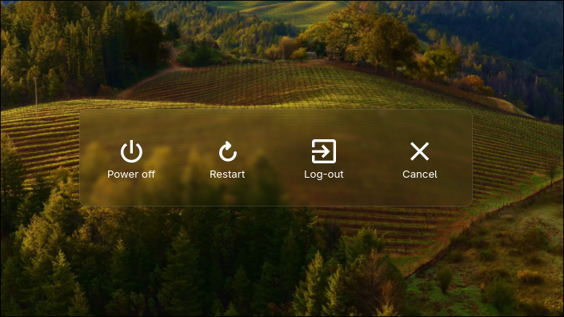
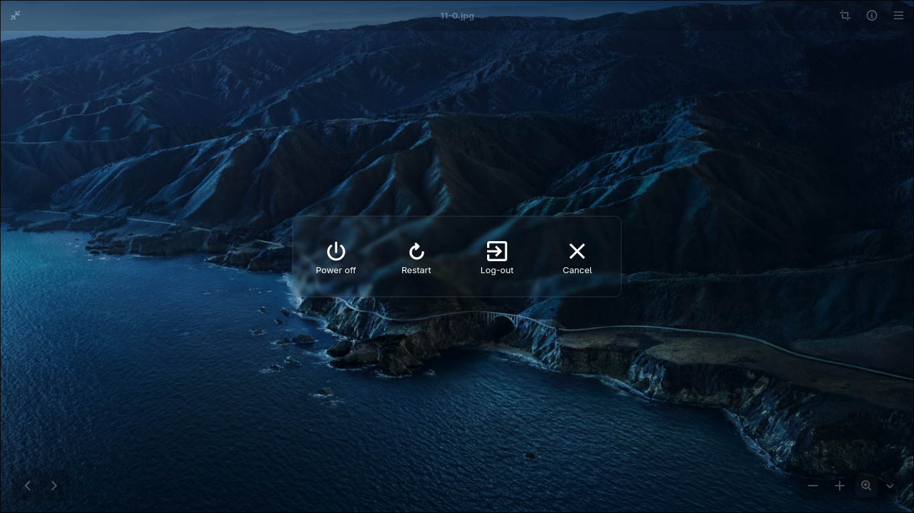

# Power menu for hyprland 

Simple app for power-off, reboot and logout for hyprland 

## Screenshots




## Installation

 Install AGS using <a href="https://aylur.github.io/ags/guide/install.html">this guide</a>
 Clone repo and cd to folder:

```bash
git clone https://github.com/androeaTT/power-menu/ && cd power-menu
```

 Run installer:

```bash
./install.sh
```

 For working blur, add this to your `hyprland.conf`:

```ini
layerrule = blur, gtk4-layer-shell
layerrule = ignorezero, gtk4-layer-shell
```

Make sure `~/.local/bin` is added to `PATH`.

## Usage 

You can run it from terminal:

```bash
power-menu
```
Bind in hyprland.conf (example):

```ini
bind = $mainMod, X, exec, power-menu
```

Use ESC for close menu

## Uninstall

- Remove app folder:

```bash
rm -rf ~/.local/share/power-menu
```

- Remove launcher:

```bash
rm ~/.local/bin/power-menu
```


